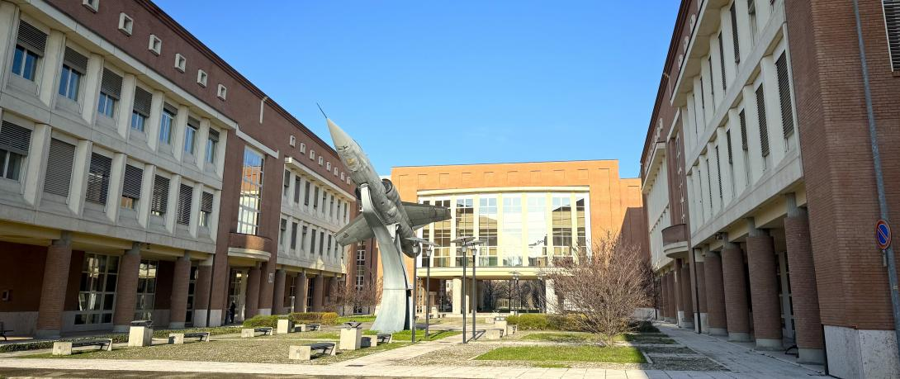

## Start a research conversation

OptoLAB welcomes enquiries about scientific collaboration, technology development, student projects and shared research questions in biomedical optics and instrumentation.

::: {.contact-panel}
::: {.contact-primary}

### Prof. Luigi Rovati

**OptoLAB lead and main contact**

[luigi.rovati@unimore.it](mailto:luigi.rovati@unimore.it)
:::

::: {.contact-details}
**Department of Engineering “Enzo Ferrari”** 
University of Modena and Reggio Emilia

**Address** 
Via Pietro Vivarelli 10, Building 26 
41125 Modena, Italy

**Public profiles** 
[Measurements, Instrumentation and Sensors Group](https://www.misure.unimore.it/) 
[OptoLAB on ResearchGate](https://www.researchgate.net/lab/OptoLab-Unimore-Luigi-Rovati)

**Map and directions** 
[Open the OptoLAB location in Google Maps](https://www.google.com/maps/search/?api=1&query=Department+of+Engineering+Enzo+Ferrari%2C+Via+Pietro+Vivarelli+10%2C+41125+Modena)
:::
:::
