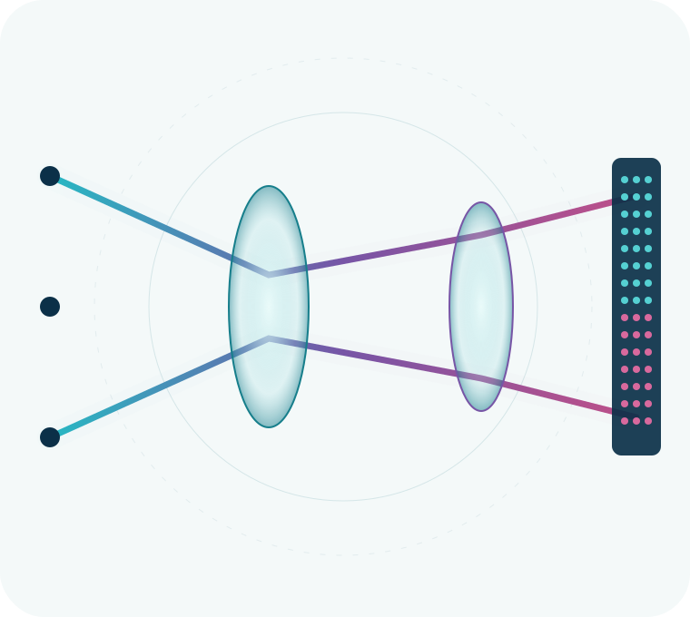

::: {.hero}
::: {.hero-copy}

University of Modena and Reggio Emilia

# Light, measured with purpose.

Optical technologies for biomedical imaging, sensing and ophthalmic instrumentation.

OptoLAB brings together optics, electronics, embedded systems and computation to explore new research instruments—from the first photon at the sensor to interpretable data.

::: {.hero-actions}
[Explore our research](research.qmd){.btn .btn-primary .btn-lg}
[Contact the lab](contact.qmd){.btn .btn-outline-primary .btn-lg}
:::
:::

::: {.hero-art}
{fig-alt="Abstract spectral light paths passing through circular optical elements and reaching a detector grid"}
:::
:::

::: {.section-intro}

Research areas

## Across optics, instruments and computation

We investigate measurement chains as connected systems: optical interaction, sensor response, electronic acquisition and computational interpretation.
:::

::: {.card-grid .three}
::: {.topic-card}
01

### Ophthalmic instrumentation

Optical and optoelectronic approaches for studying the eye and supporting the development of research instrumentation.

[Explore the area →](research.qmd#ophthalmic-instrumentation)
:::

::: {.topic-card}
02

### Biomedical optical imaging

Imaging architectures and acquisition methods designed around biological measurement questions.

[Explore the area →](research.qmd#biomedical-optical-imaging)
:::

::: {.topic-card}
03

### Wearable optical sensing

Compact sensing concepts that combine optical interfaces, embedded acquisition and signal processing.

[Explore the area →](research.qmd#wearable-optical-sensing)
:::

::: {.topic-card}
04

### Spectral sensing

Colorimetric and multispectral methods, including calibration strategies for compact multi-channel sensors.

[Explore the area →](research.qmd#colorimetry-and-spectral-sensing)
:::

::: {.topic-card}
05

### Embedded acquisition

Hardware–software co-design for experimental control, sensor readout and connected prototypes.

[Explore the area →](research.qmd#embedded-acquisition-systems)
:::

::: {.topic-card}
06

### Computational imaging & AI

Computational methods that support reconstruction, analysis and interpretation of optical data.

[Explore the area →](research.qmd#computational-imaging-and-ai)
:::
:::

::: {.band}
::: {.section-intro}

Selected work

## From measurement idea to research demonstrator

These provisional examples describe technology directions, not funded projects or validated outcomes. They will be replaced as institutional content is reviewed.
:::

::: {.card-grid .three}
::: {.work-card}

### Multichannel sensor calibration

Research area exploring flexible calibration workflows for compact photometric and radiometric sensing.

[View demonstrator](projects/items/multichannel-calibration.qmd)
:::

::: {.work-card}

### Embedded camera acquisition

Technology demonstrator connecting an ESP32-S3 camera, a readable TCP protocol and a desktop interface.

[View demonstrator](projects/items/embedded-camera.qmd)
:::

::: {.work-card}

### Wearable optical platform

Research-area placeholder for compact optical sensing, embedded acquisition and signal interpretation.

[View demonstrator](projects/items/wearable-optics.qmd)
:::
:::
:::

::: {.split-section}
::: {.split-copy}

Capabilities

## Building the complete measurement chain

Our work spans the interfaces between light, hardware and information. The current capability map is intentionally qualitative while facilities and equipment records are being verified.
:::

::: {.capability-list}
- **Optical architecture** — illumination, collection and sensing concepts
- **Optoelectronic instrumentation** — sensor interfaces and measurement electronics
- **Embedded systems** — acquisition, control and device communication
- **Experimental software** — desktop tools, protocols and data inspection
- **Calibration** — photometric, radiometric and multichannel workflows
- **Computational methods** — signal processing, imaging and AI exploration
:::
:::

::: {.open-science}
::: {.open-science-mark}
`{ }`
:::
::: {.open-science-copy}

Open science & software

## Inspectable tools for learning and research

Public repositories make methods easier to examine, teach and extend. Explore verified OptoLAB resources for sensor calibration, embedded camera acquisition and serial instrumentation.

[Browse software & resources](software.qmd){.btn .btn-light}
[Visit GitHub](https://github.com/OPTOLAB-UNIMORE){.btn .btn-outline-light}
:::
:::

::: {.collab-cta}

Collaborate

## A measurement challenge is a good place to start.

We welcome conversations with academic and industrial partners working at the intersection of biomedical optics, sensing and research instrumentation.

[Start a conversation](contact.qmd){.btn .btn-primary .btn-lg}
:::
