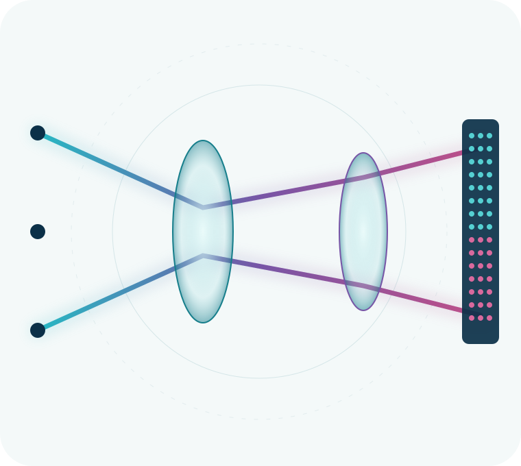

::: {.hero}
::: {.hero-copy}

OPTOLAB - University of Modena and Reggio Emilia

# Light measurement and beyond

An Electronic Measurement laboratory specialized in Optoelectronics instrumentation, devices and technologies.

Led by Prof. Luigi Rovati, OptoLAB designs, builds and characterizes optical measurement systems for biomedical, ophthalmic, environmental and automotive applications, bringing together optics, electronics, embedded systems and computation across the whole measurement chain.

::: {.hero-actions}
[Explore our research](research.qmd){.btn .btn-primary .btn-lg}
[Contact the lab](team.qmd#contact){.btn .btn-outline-primary .btn-lg}
:::
:::

::: {.hero-art}
{fig-alt="Abstract spectral light paths passing through circular optical elements and reaching a detector grid"}
:::
:::

::: {.section-intro}

Research

## What we investigate

We treat optical measurement as a connected chain, from optical interaction and sensor response to electronic acquisition and computational interpretation. Our activity spans ophthalmic instrumentation, biomedical optical imaging, wearable and spectral sensing, embedded acquisition and computational imaging.

[Explore our research →](research.qmd){.btn .btn-primary .btn-lg}
:::

::: {.section-intro}

News

## Latest news
:::

:::{#latest-news}
:::

::: {.section-intro}
[See all news →](news/index.qmd){.btn .btn-outline-primary .btn-lg}
:::

::: {.collab-cta}

Collaborate

## A measurement challenge is a good place to start.

We welcome conversations with academic and industrial partners working at the intersection of biomedical optics, sensing and research instrumentation.

[Contact the lab](team.qmd#contact){.btn .btn-primary .btn-lg}
:::
