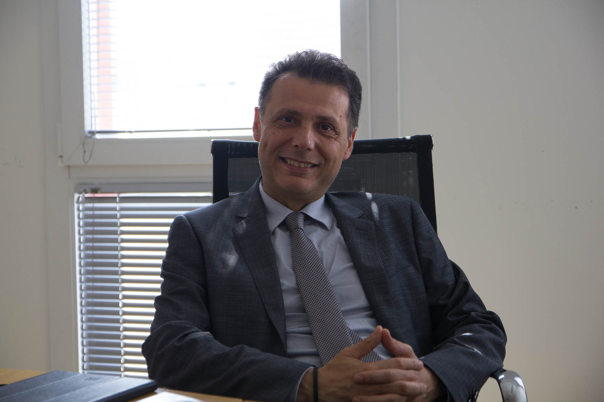
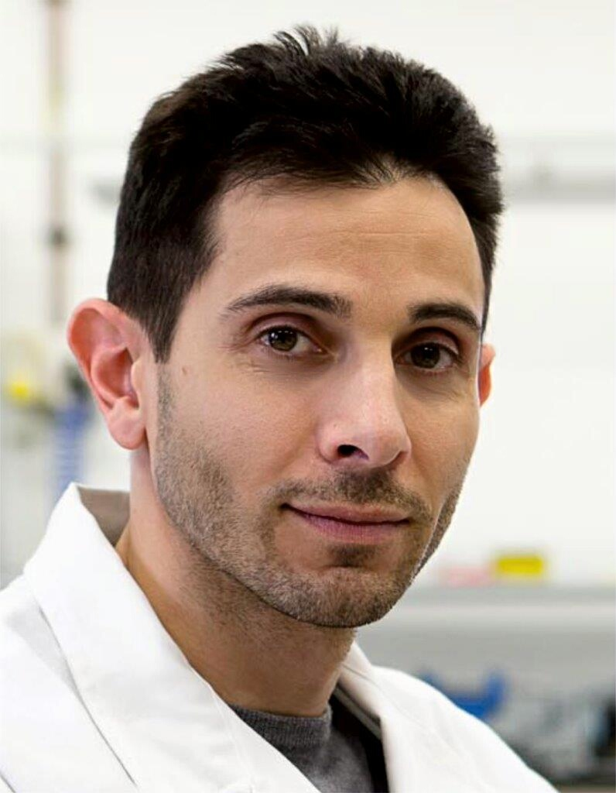
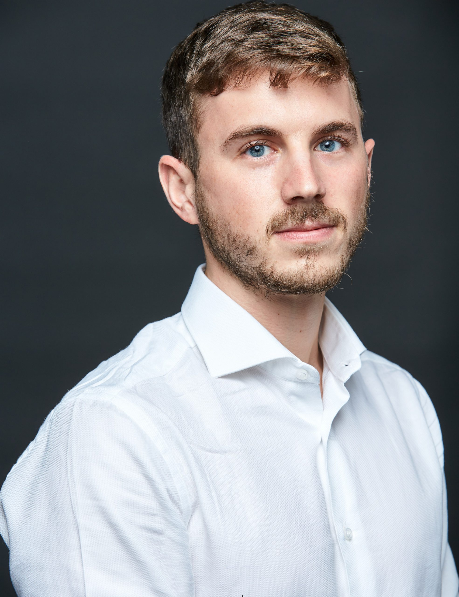
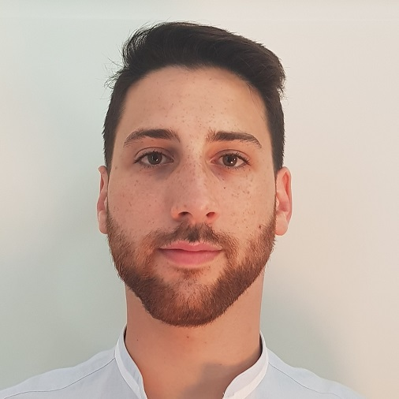
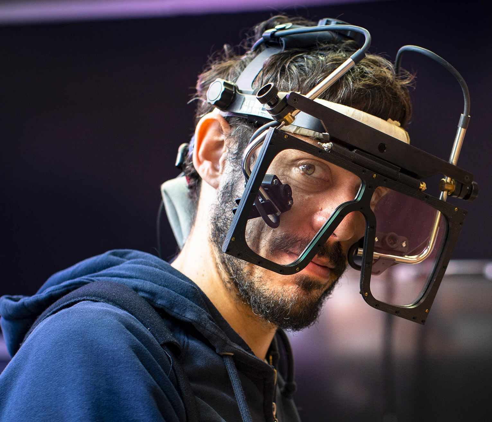
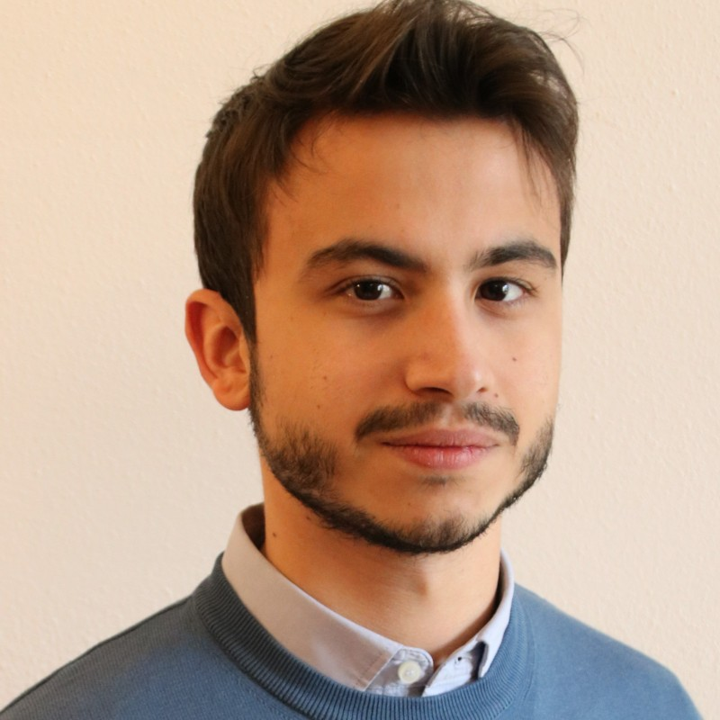

OptoLAB is led by Prof. Luigi Rovati and brings together expertise in measurement science, biomedical engineering, vision science, electronics and optical instrumentation.

::: {.people-grid}
::: {.person-card}

### Luigi Rovati

Full Professor · Laboratory Head

Measurement science and optoelectronic instrumentation for biomedical and ophthalmic applications, with particular attention to weak optical signals and metrological characterization.

[UNIMORE profile](https://unimore.unifind.cineca.it/resource/person/66046?language=en_US) · [ResearchGate](https://www.researchgate.net/profile/Luigi-Rovati)
:::

::: {.person-card}

### Stefano Cattini

Associate Professor

Electronic measurements, sensor systems and measurement methods for industrial, automotive and biomedical applications.

[UNIMORE profile](https://unimore.unifind.cineca.it/resource/person/70100) · [ResearchGate](https://www.researchgate.net/profile/Stefano-Cattini) · [ORCID](https://orcid.org/0000-0001-7466-9629)
:::

::: {.person-card}

### Giovanni Gibertoni

Assistant Professor · Bioengineering

Biomedical optical instrumentation, ophthalmic imaging, image-quality assessment and computational methods for ocular measurements.

[UNIMORE profile](https://unimore.unifind.cineca.it/resource/person/172668) · [ResearchGate](https://www.researchgate.net/profile/Giovanni-Gibertoni) · [GitHub](https://github.com/gbrgnn)
:::

::: {.person-card}

### Davide Cassanelli

Researcher · Automotive

Optical measurement systems and sensor characterization, including LiDAR safety and portable fluorescence instrumentation.

[Group profile](https://www.misure.unimore.it/staff/) · [ResearchGate](https://www.researchgate.net/profile/Davide-Cassanelli-2)
:::

::: {.person-card}

### Agostino Gibaldi

Assistant Professor · Bioengineering

Vision science, binocular vision, eye tracking, wearable systems and computational models of visual behaviour.

[UNIMORE profile](https://unimore.unifind.cineca.it/resource/person/274103) · [ResearchGate](https://www.researchgate.net/profile/Agostino-Gibaldi)
:::

::: {.person-card}

### Daniele Goldoni

Researcher · Biomedical

Biomedical measurement systems, electronics, signal processing and sensor-based methods for biological and environmental analysis.

[Group profile](https://www.misure.unimore.it/staff/) · [ResearchGate](https://www.researchgate.net/profile/Daniele-Goldoni) · [Google Scholar](https://scholar.google.com/citations?hl=en&user=KOyMMasAAAAJ)
:::

::: {.person-card}

AB

### Alberto Besozzi

PhD Student

Doctoral researcher working on compact optical sensors, flexible calibration and wearable measurement systems under the supervision of Agostino Gibaldi and Luigi Rovati.

[PhD programme](https://www.ict.unimore.it/phdStudents.asp) · [Recent publication](https://iris.unimore.it/handle/11380/1412808)
:::
:::
