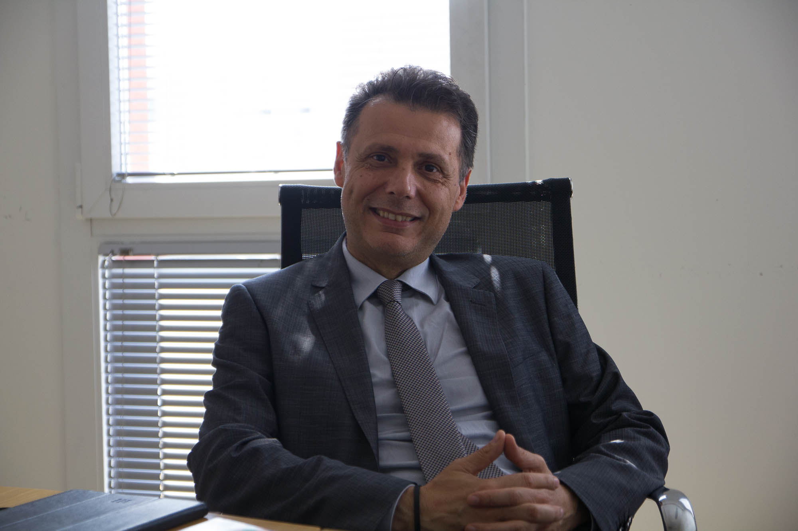
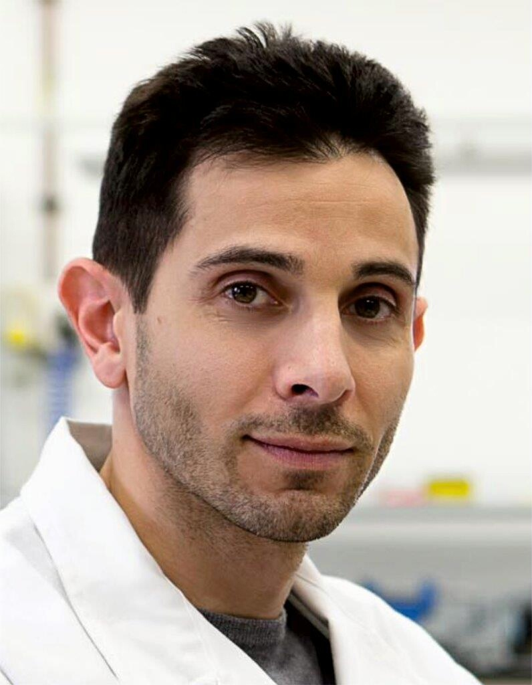
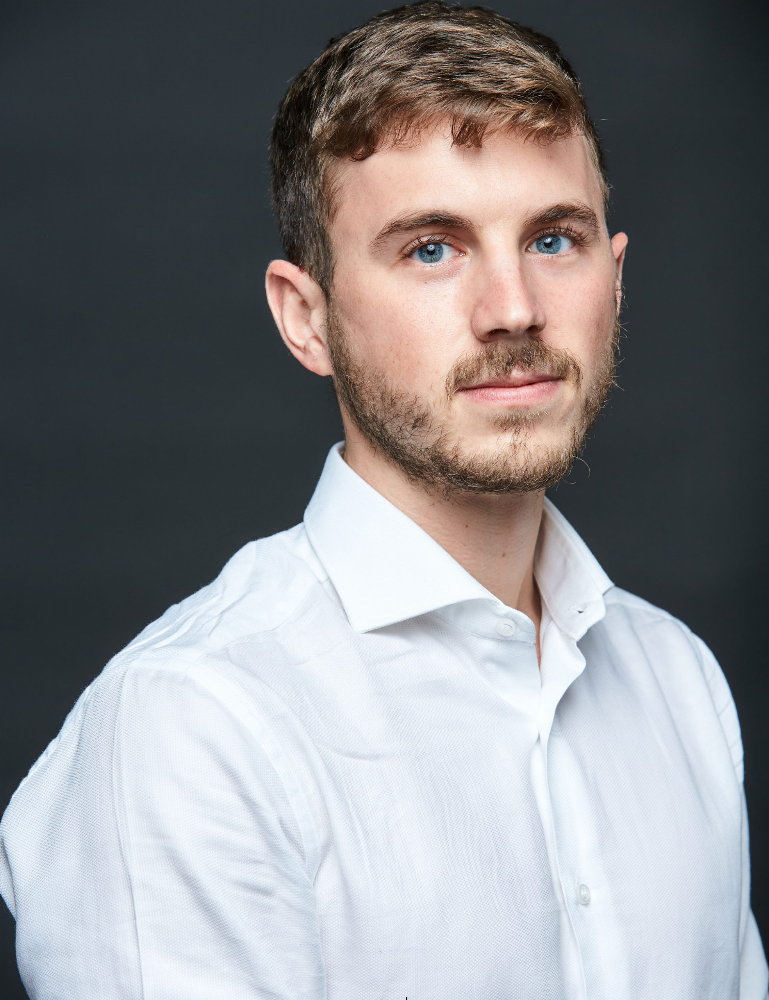
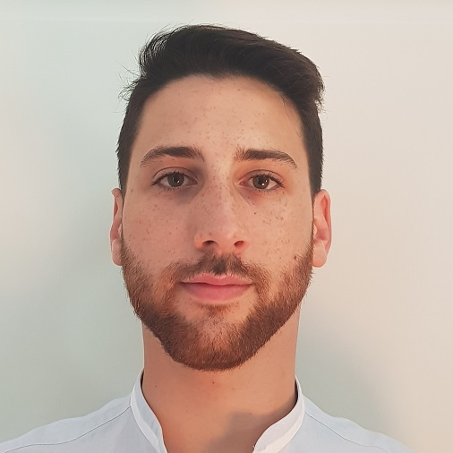
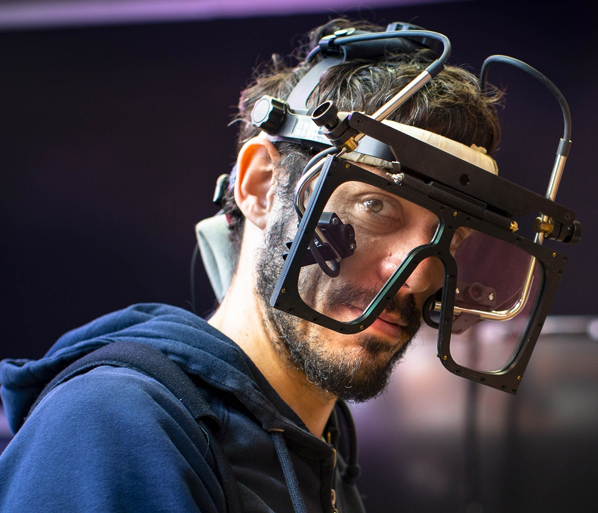
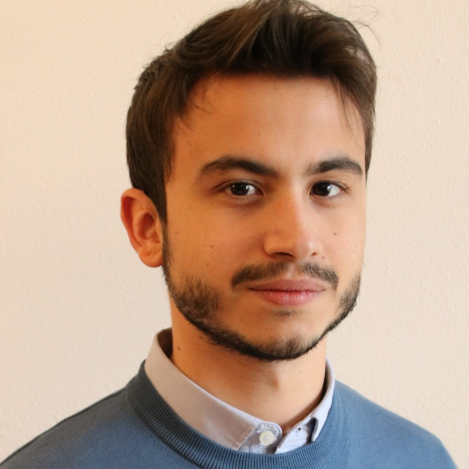
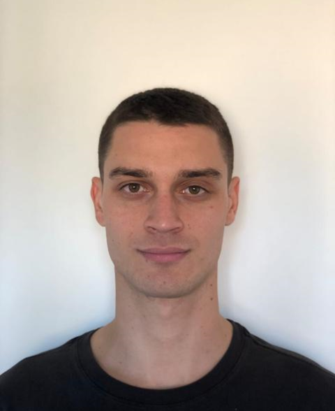
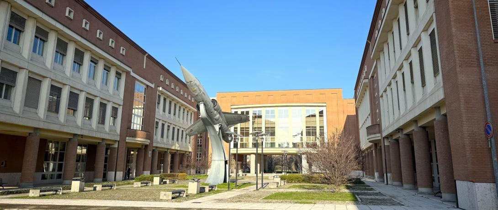

OptoLAB is led by Prof. Luigi Rovati and brings together expertise in measurement science, biomedical engineering, vision science, electronics and optical instrumentation.

::: {.people-grid}
::: {.person-card}

### Luigi Rovati

Full Professor · Laboratory Head

Measurement science and optoelectronic instrumentation for biomedical and ophthalmic applications, with particular attention to weak optical signals and metrological characterization.

<a href="mailto:luigi.rovati@unimore.it">luigi.rovati@unimore.it</a>

[UniFind profile](https://unimore.unifind.cineca.it/resource/person/66046?language=en_US) · [Google Scholar](https://scholar.google.com/citations?user=tYqaJ6gAAAAJ&hl=it) · [ORCID](https://orcid.org/0000-0002-1743-3043) · [ResearchGate](https://www.researchgate.net/profile/Luigi-Rovati)
:::

::: {.person-card}

### Stefano Cattini

Associate Professor

Electronic measurements, sensor systems and measurement methods for industrial, automotive and biomedical applications.

<a href="mailto:stefano.cattini@unimore.it">stefano.cattini@unimore.it</a>

[UniFind profile](https://unimore.unifind.cineca.it/resource/person/70100) · [Google Scholar](https://scholar.google.com/citations?user=6RR2jJcAAAAJ&hl=it) · [ORCID](https://orcid.org/0000-0001-7466-9629) · [ResearchGate](https://www.researchgate.net/profile/Stefano-Cattini)
:::

::: {.person-card}

### Giovanni Gibertoni

Assistant Professor · Bioengineering

Biomedical optical instrumentation, ophthalmic imaging, image-quality assessment and computational methods for ocular measurements.

<a href="mailto:giovanni.gibertoni@unimore.it">giovanni.gibertoni@unimore.it</a>

[UniFind profile](https://unimore.unifind.cineca.it/resource/person/172668) · [Google Scholar](https://scholar.google.com/citations?user=DOEnqygAAAAJ&hl=it) · [ORCID](https://orcid.org/0000-0003-3312-3616) · [ResearchGate](https://www.researchgate.net/profile/Giovanni-Gibertoni)
:::

::: {.person-card}

### Davide Cassanelli

Researcher · Automotive

Optical measurement systems and sensor characterization, including LiDAR safety and portable fluorescence instrumentation.

<a href="mailto:davide.cassanelli@unimore.it">davide.cassanelli@unimore.it</a>

[UniFind profile](https://unimore.unifind.cineca.it/individual?uri=http%3A%2F%2Firises.unimore.it%2Fresource%2Fperson%2F134454) · [Google Scholar](https://scholar.google.com/citations?user=Xwie4UkAAAAJ&hl=it) · [ORCID](https://orcid.org/0000-0003-4834-5107) · [ResearchGate](https://www.researchgate.net/profile/Davide-Cassanelli-2)
:::

::: {.person-card}

### Agostino Gibaldi

Assistant Professor · Bioengineering

Vision science, binocular vision, eye tracking, wearable systems and computational models of visual behaviour.

<a href="mailto:agostino.gibaldi@unimore.it">agostino.gibaldi@unimore.it</a>

[UniFind profile](https://unimore.unifind.cineca.it/resource/person/274103) · [Google Scholar](https://scholar.google.com/citations?user=1M3nfPAAAAAJ&hl=it) · [ORCID](https://orcid.org/0000-0003-4478-6351) · [ResearchGate](https://www.researchgate.net/profile/Agostino-Gibaldi)
:::

::: {.person-card}

### Daniele Goldoni

Researcher · Biomedical

Biomedical measurement systems, electronics, signal processing and sensor-based methods for biological and environmental analysis.

<a href="mailto:daniele.goldoni@unimore.it">daniele.goldoni@unimore.it</a>

[Google Scholar](https://scholar.google.com/citations?user=KOyMMasAAAAJ&hl=it) · [ORCID](https://orcid.org/0000-0002-7247-9554) · [ResearchGate](https://www.researchgate.net/profile/Daniele-Goldoni)
:::

::: {.person-card}

### Alberto Besozzi

PhD Student

Doctoral researcher working on compact optical sensors, flexible calibration and wearable measurement systems under the supervision of Agostino Gibaldi and Luigi Rovati.

<a href="mailto:alberto.besozzi@unimore.it">alberto.besozzi@unimore.it</a>

[UniFind profile](https://unimore.unifind.cineca.it/resource/person/232859) · [Google Scholar](https://scholar.google.com/citations?user=Z4Lv8ncAAAAJ&hl=it) · [ORCID](https://orcid.org/0009-0003-3153-2544) · [ResearchGate](https://www.researchgate.net/profile/Alberto-Besozzi)
:::
:::

## Contact

OptoLAB welcomes enquiries about scientific collaboration, technology development, student projects and shared research questions in biomedical optics and instrumentation.

::: {.contact-panel}
::: {.contact-primary}

### Prof. Luigi Rovati

**OptoLAB lead and main contact**

[luigi.rovati@unimore.it](mailto:luigi.rovati@unimore.it)
:::

::: {.contact-details}
**Department of Engineering “Enzo Ferrari”** 
University of Modena and Reggio Emilia

**Address** 
Via Pietro Vivarelli 10, Building 26 
41125 Modena, Italy

**Public profiles** 
[Measurements, Instrumentation and Sensors Group](https://www.misure.unimore.it/) 
[OptoLAB on ResearchGate](https://www.researchgate.net/lab/OptoLab-Unimore-Luigi-Rovati)

**Map and directions** 
[Open the OptoLAB location in Google Maps](https://www.google.com/maps/search/?api=1&query=Department+of+Engineering+Enzo+Ferrari%2C+Via+Pietro+Vivarelli+10%2C+41125+Modena)
:::
:::
